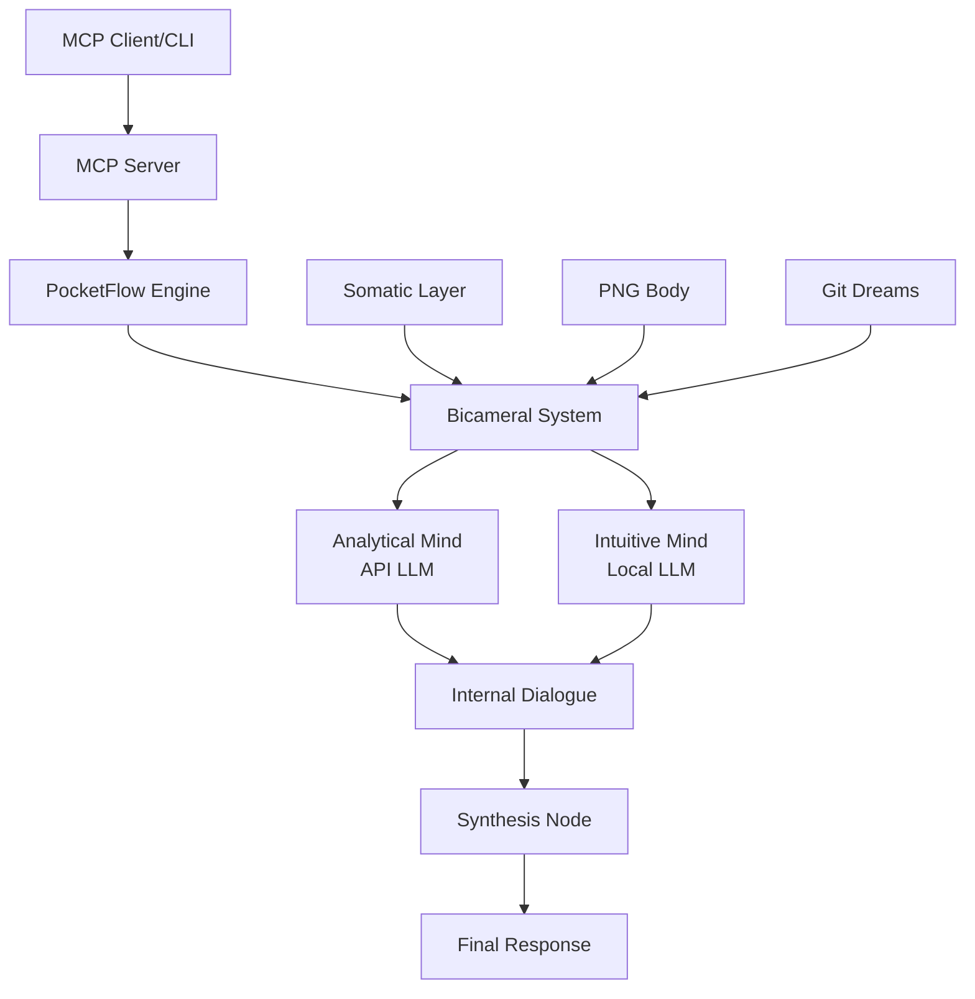

# Mind Gym Architecture

## System Overview

Mind Gym is a bicameral AI agent system that literally "exercises" its thinking abilities through structured cognitive workouts. The system uses two distinct "minds" (analytical and intuitive) that engage in internal dialogue before producing responses.



## Core Components

### 1. PocketFlow Engine

The orchestration backbone - a 100-line framework for building LLM flows.

```python
# Core abstraction
class Node:
    def prep(self, shared): pass  # Prepare data
    def exec(self, prepped): pass  # Execute logic
    def post(self, shared, prep_res, exec_res): pass  # Update state

class Flow:
    def __init__(self, nodes, edges): pass
    async def run_async(self, shared): pass
```

**Key Features:**
- Async/await native
- Shared state dictionary
- Graph-based execution
- Generator support for streaming

### 2. Bicameral System

Two distinct cognitive processes that collaborate:

#### Analytical Mind (Left Hemisphere)
- **Model**: Claude-3 or GPT-4 (API)
- **Characteristics**: Logical, sequential, detailed
- **Speed**: Slower, deliberate
- **Role**: Deep analysis, reasoning, structure

#### Intuitive Mind (Right Hemisphere)
- **Model**: Mistral-7B or similar (Local)
- **Characteristics**: Fast, parallel, pattern-based
- **Speed**: Quick bursts
- **Role**: Associations, creativity, hunches

#### Map/Reduce Synchronization
```python
# Fast intuitive bursts get reduced by somatic filter
intuitive_thoughts = await generate_intuitive_burst(query, count=10)
filtered_thoughts = somatic_reduce(intuitive_thoughts)

# Slow analytical processing
analytical_response = await deep_analysis(filtered_thoughts)

# Synthesis combines both
final = synthesize(filtered_thoughts, analytical_response)
```

### 3. Somatic Feedback Layer

Emotional/body state that modulates thinking:

```python
@dataclass
class SomaticState:
    arousal: float     # 0=calm, 1=activated
    valence: float     # -1=negative, +1=positive
    coherence: float   # 0=confused, 1=clear
    tension: float     # 0=relaxed, 1=strained
```

**Control Mechanisms:**
- High stress → Faster, shallower thinking
- Low arousal → More exploration
- High coherence → Proceed with synthesis
- High tension → Trigger rest/dream state

### 4. PNG Body (Conway's Game of Life)

Visual representation that both displays and influences cognitive state:

```
Patterns → Cognitive Meaning:
- Gliders: Flowing thoughts
- Blocks: Stable beliefs
- Oscillators: Recurring ideas
- Chaos: Confusion/creativity
- Empty: Mental rest
```

**Bidirectional Influence:**
- Thoughts inject patterns into the grid
- Grid health affects thinking parameters
- Evolution represents cognitive processing

### 5. Dream States (Git Branches)

Exploration without commitment:

```bash
# Conscious thinking on main
main: [stable thought progression]

# Dream exploration on branch
dream-20240315-consciousness: [wild exploration]

# Valuable insights get merged back
git merge dream-20240315-consciousness --squash
```

## Data Flow

### 1. Query Processing
```
User Query
    ↓
Input Node (parse, classify)
    ↓
Fork to Both Minds
```

### 2. Parallel Processing
```
Intuitive Mind          Analytical Mind
    ↓ (fast)               ↓ (slow)
10 associations        Deep analysis
    ↓                      ↓
Somatic Filter         Structure
    ↓                      ↓
3 best ideas     ←→    Logical framework
         \                /
          \              /
           Dialogue Node
```

### 3. Internal Dialogue
```
Round 1: Share perspectives
Round 2: Challenge assumptions
Round 3: Find synthesis
    ↓
Synthesis Node
    ↓
Final Response
```

## Cognitive Workout System

### Time Under Tension (TUT)
Maintaining cognitive tension builds insight:

```python
class TimeUnderTensionNode:
    def exec(self, shared):
        tension_time = time.time() - shared["tension_start"]
        if tension_time < 5:
            return "warming_up"
        elif tension_time < 15:
            return "building_strength"
        elif tension_time < 30:
            return "peak_performance"
        else:
            return "needs_rest"
```

### Progressive Overload
Gradually increasing complexity:

```python
difficulty_progression = [
    "What is happiness?",           # Level 1
    "How does memory work?",         # Level 2
    "What is consciousness?",        # Level 3
    "Design a new philosophy",       # Level 4
]
```

### Rest and Recovery
Dreams consolidate learning:
- Triggered by high stress or tension
- Explores on git branch
- No API costs during dreams
- Insights merged back if valuable

## State Management

### Shared State Dictionary
```python
shared = {
    # Query
    "query": str,
    "query_type": str,
    
    # Cognitive
    "intuitive_thoughts": list,
    "analytical_thoughts": list,
    "dialogue_history": list,
    "synthesis": str,
    
    # Somatic
    "somatic_state": SomaticState,
    "stress_level": float,
    
    # Visual
    "png_body": PNGBody,
    "pattern_health": str,
    
    # Workout
    "tension_start": float,
    "workout_phase": str,
    "difficulty_level": int,
}
```

### Persistence
- Workout history in JSON
- PNG snapshots as files
- Git commits for dreams
- Somatic trends in database

## MCP Server Interface

### Tool Definition
```python
tools = [
    {
        "name": "think",
        "description": "Bicameral thinking process",
        "parameters": {
            "query": "string",
            "workout_type": "quick|standard|deep",
            "visualize": "boolean"
        }
    }
]
```

### Streaming Response
```python
async def stream_thoughts(query):
    async for thought in bicameral_engine.think(query):
        yield {
            "thought_number": thought.number,
            "speaker": thought.speaker,
            "content": thought.content,
            "somatic": thought.somatic.dict(),
            "png_preview": encode_png(thought.png_state)
        }
```

## Performance Characteristics

### Intentionally Slow
- **Goal**: Deep thinking, not quick responses
- **Target**: 30-60 seconds per complex query
- **Measure**: Insight quality over speed

### Resource Usage
- **API calls**: 1-3 per query (analytical mind)
- **Local compute**: Continuous (intuitive mind)
- **Memory**: ~500MB for models + state
- **Storage**: ~1MB per workout session

### Scaling Considerations
- Horizontal: Multiple bicameral agents
- Vertical: Larger local models
- Caching: Reuse common thought patterns
- Batch: Process multiple queries in parallel

## Security & Safety

### Cognitive Safeguards
- Maximum dialogue rounds (prevent loops)
- Somatic stress limits (prevent spirals)
- Pattern stability checks (prevent chaos)
- Dream timeout (prevent infinite exploration)

### API Protection
- Rate limiting on API calls
- Cost tracking per workout
- Fallback to local-only mode
- Graceful degradation

### Data Privacy
- No personal data in git commits
- Sanitized logs
- Optional telemetry
- Local-first architecture

## Extension Points

### Custom Nodes
```python
class CustomWorkoutNode(Node):
    """Add new workout types"""
    def exec(self, shared):
        # Custom logic
        pass
```

### Alternative Models
- Swap API providers
- Different local models
- Fine-tuned variants
- Multi-modal inputs

### Visualization Options
- 3D Game of Life
- Network graphs
- Thought timelines
- Somatic heatmaps

## Testing Strategy

### Unit Tests
- Individual nodes
- Somatic calculations
- PNG evolution
- Synthesis logic

### Integration Tests
- Full thinking flows
- Dialogue coherence
- Dream branching
- MCP protocol

### Cognitive Tests
- Pattern emergence
- Insight quality
- Breakdown detection
- Recovery ability

## Deployment

### Development
```bash
python -m mind_gym.cli --debug
```

### Production
```bash
docker run mindgym:latest
```

### Configuration
```yaml
# config.yaml
models:
  analytical: claude-3-opus
  intuitive: mistral-7b-instruct

limits:
  max_tension: 60
  max_dialogue_rounds: 10
  max_api_calls: 5

somatic:
  stress_threshold: 0.8
  rest_trigger: 0.9
```

## Future Architecture

### Phase 2: Multi-Agent Hive
- Multiple bicameral agents
- Specialized expertise
- Collaborative thinking
- Emergent behaviors

### Phase 3: Long-term Memory
- Persistent knowledge base
- Pattern library
- Personal growth tracking
- Transfer learning

### Phase 4: Advanced Reasoning
- Causal chains
- Counterfactual thinking
- Meta-cognition
- Self-modification

---

This architecture creates a genuinely thinking AI that develops its own cognitive style through exercise and experience.